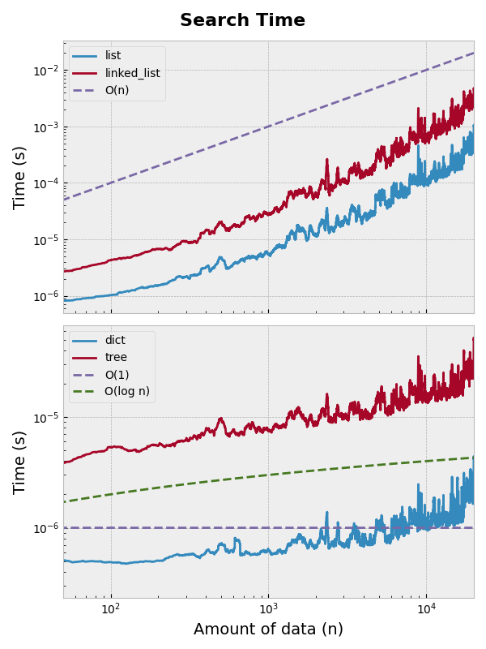

# Python Algorithms

_An **Algorithm** is any well-defined computational procedure that takes some set of values 
as input, and produces a set of values as output_. It is a sequence of computational 
steps that when executed will transform an input into the desired output.

Some problems might arise frequently in practice, and knowing well known techniques
for solving these problems is very useful to improve the efficiency and performance
of the designed solutions. An example of a problem that we can face frequently is the
need for **sorting** an amount of data. This might look as a simple problem to be solved,
but providing an efficient way to do so is not very trivial. Therefore, in this repository
I implement some of the most known sorting algorithms and evaluate their performance.
Such implementations and evaluations can be found at [Sorting Algorithms](src/sorting_algorithms).

Another very frequent situation that might arise is the need for searching items, paths,
minimum or maximum values, etc. For this we also have some renown algorithms, and I have 
chosen to present just a sample of some of the most known. At [Search Algorithms](src/search_algorithms)
I provide classes for finding items with **Linear Search** and **Binary Search** algorithms.
Furthermore, I provide implementations of **Breadth-First Search**, **Depth-First Search** and **Dijkstra**
algorithms, which are very useful when dealing with complex situations involving the interaction
of multiple elements between each other.

To make the implementation of such algorithms possible in an efficient manner, a set of
Data Structures have been proposed, each with it own characteristics and benefits. Therefore,
I also provide at [Data Structures](src/data_structures) the implementation of these structures,
which the memory performance and processing time is presented below.

## Data Structures Performance
Data structures are fundamental components of computer science that help in organizing,
storing, and managing data efficiently. 
They enable optimal data manipulation, retrieval, and storage, improving the performance of algorithms. 
Common data structures include arrays, linked lists, stacks, queues, trees, 
and graphs, each suited for specific tasks. 
We can consider the following table to do the best choice when deciding which one to use.

| **Data Structure**    | **Access Time** | **Search Time** | **Insertion/Deletion** | **Memory Usage** | **Best Use Cases** |
|-----------------------|----------------|-----------------|------------------------|------------------|---------------------|
| **Array**            | O(1)            | O(n)            | O(n) (for shifting)    | Fixed size       | Static data, fast index access |
| **Linked List**      | O(n)            | O(n)            | O(1) (at head/tail)    | Dynamic size     | Frequent insertions/deletions |
| **Stack**           | O(n)            | O(n)            | O(1) (push/pop)        | Dynamic size     | Backtracking, function calls |
| **Queue**           | O(n)            | O(n)            | O(1) (enqueue/dequeue) | Dynamic size     | Scheduling, breadth-first search |
| **Hash Table / Dict** | O(1) (average) | O(1) (average)  | O(1) (average)        | High (depends on load factor) | Fast lookups, key-value mapping (e.g., Python `dict`) |
| **Binary Tree**      | O(log n)        | O(log n)        | O(log n) (balanced)   | Dynamic size     | Hierarchical data, search trees |

In this repository I have implemented Linked List, Queue, Stack and BinaryTree which are introduced at
[Data Structures](src/data_structures). To verify the specifics of each type, I have accomplished a set of 
test to measure memory usage and performance in different conditions.

### Memory
When we put different data structures holding the same data we can verify the difference memory needed
by each one. I have compared the memory needed by [List, Dictionary, Linked List, Queue, Stack and Binary Tree]
to hold 400 random data values. These values were added one by one and the memory after each inclusion
was measured.

The result shows continuous increase in the memory for the types I have implements here, and continuous increase
followed by periodical resize of the data chunks for the List and the Dictionary. The memory required by 
the new structures is 4 to 5 times bigger than the needed for a List, due to the implementation of a Node
class that is used in the dynamic allocation of the data.

 

**Arrays** generally offer better memory efficiency for small datasets due to their contiguous storage, 
minimal overhead, and superior cache locality, making them ideal for fast random access. However, 
they suffer from resizing overhead and fragmentation issues when dynamically growing. 
In contrast, **Linked Lists** provide flexible memory allocation and efficient insertions/deletions without 
resizing, making them preferable for frequently changing data structures. Despite this advantage, 
linked lists have higher memory overhead due to pointers and suffer from poor cache locality.

### Processing Time
In addition to the memory analysis, we have verified the processing time to **Insert**, **Search** and **Delete**
values from 4 types of data structure (List, Linked List, Dictionary and Trees). Of course the comparison of a 
structure developed completely in Python against a built-in python type (processed a C code) is not fair. Although,
we can verify the complexity time for each type. The three tests (Insertion, Search and Deletion) where executed with 
20.000 random datapoints, to be processed in random indexes of the structures, avoiding getting only best time from the executions. 
- With the tests it was confirmed the **linear complexity O(n)** from the **List** and **Linked List**(as in the table above), 
due to the constant need of data shift for the List and the dependency on a search for the Linked List.
 - When we verify the processing time for the **Dictionary** and for the **Binary Tree**, we can see a better performance.
The Binary Tree presents the expected behavior of a **O(log n)**, verified by comparing it to the reference curve. 
And the Dictionary, since it is implemented in python as a hash table, has shown a constant behavior, with some
noticeable variations after 3.000 datapoints, which might be justified due to table resizing, memory overhead or 
hash collisions (rare cases).

 
 
 

## Sorting Algorithms Performance